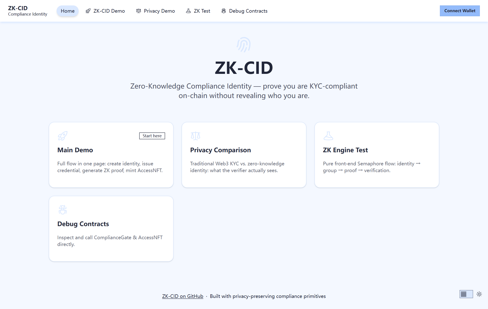
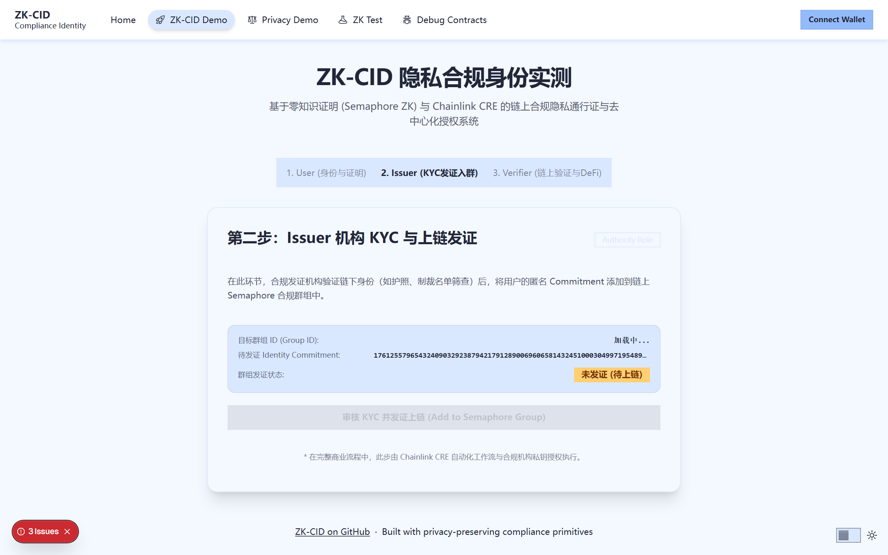
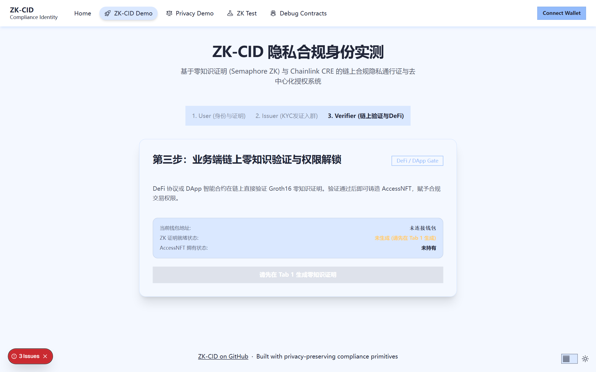
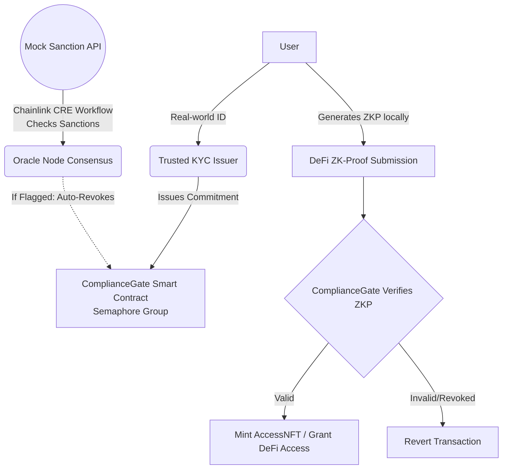

# ZK-CID 🛡️
**Zero-Knowledge Compliance Identity & Decentralized Workflow Orchestration**

[](https://github.com/juangh123/WEB-3.0-Decentralized/actions/workflows/ci.yml)

> **一句话定位**: "ZK-CID 用 ZK 零知识证明保护 Web3 用户验证端隐私，用 Chainlink CRE 消除颁发端信任——合规数据由去中心化预言机网络自动编排，用户隐私由数学密码学守护。"

🏆 **Track**: Law / Finance / Compliance (Blockchain Legal Institute) & Best Workflow with CRE (Chainlink)

🌐 **Live Demo**: [https://web-3-0-decentralized.vercel.app](https://web-3-0-decentralized.vercel.app)

🎥 **Demo Video**: [Watch Demo](https://web-3-0-decentralized.vercel.app/demo/zk-cid-pitch-video-en.mp4)

| Landing | Issuer (KYC → on-chain credential) | Verifier (ZK proof → AccessNFT) |
| --- | --- | --- |
|  |  |  |

## Hackathon Submission

- **Event**: [BLI Legal Tech Hackathon 2 (legal-hack-2026)](https://dorahacks.io/hackathon/legal-hack-2026)
- **Deadline**: 2026-11-01 01:01 UTC (Beijing time 09:01)
- **Track**: `All BUIDLs` (the only selectable track; LegalTech & RegTech is a category inside it)
- **Bounty**: [Chainlink CRE — Best Workflow with CRE](https://dorahacks.io/hackathon/bounty/1362)
- **Submission**: [ZK-CID on DoraHacks](https://dorahacks.io/buidl/48603) — published 2026-10-02, under review

## Verify It Yourself

```bash
cd zk-cid
yarn install --immutable
yarn hardhat:test                                  # contract tests
yarn next:build                                    # frontend production build
yarn workspace compliance-lifecycle compile        # CRE workflow type check
yarn workspace zk-cid-mock-sanctions-api test      # mock sanctions API
```

The Chainlink CRE workflow is also verified with the official CLI — `cre workflow
build` and `cre workflow simulate` both run end to end
([raw log](zk-cid/workflows/compliance-lifecycle/evidence/cre-simulate-20261002-215452.log)):
DON-consensus fetch of the sanctions API, `getMembers()`/`getLeaves()` reads
against the Sepolia deployment, Semaphore-tree rebuild with real Merkle
siblings, and the revoke branch (`{"status":"revoked","revokedCount":1}`).

Sepolia deployment, transaction hashes and the CRE evidence chain are documented in
[zk-cid/SEPOLIA_DEPLOYMENT.md](zk-cid/SEPOLIA_DEPLOYMENT.md) and
[zk-cid/workflows/compliance-lifecycle/evidence/README.md](zk-cid/workflows/compliance-lifecycle/evidence/README.md).
Known limitations (demo mode, broadcast boundary) are listed in
[zk-cid/README.md](zk-cid/README.md).

## Live Deployment

- **ComplianceGate (Sepolia)**: `0x1b8ae78C37c3E29DFcB0236E1c562b3CCFA44F70`
- **AccessNFT (Sepolia)**: `0x5e7140b8c967440A5B7Db15a4B82F4e4428cCc32`
- **Mock sanctions API**: [https://mock-api-topaz-zeta.vercel.app/api/sanctions-list](https://mock-api-topaz-zeta.vercel.app/api/sanctions-list)
- **Verified source**: [ComplianceGate](https://eth-sepolia.blockscout.com/address/0x1b8ae78C37c3E29DFcB0236E1c562b3CCFA44F70#code) · [AccessNFT](https://eth-sepolia.blockscout.com/address/0x5e7140b8c967440A5B7Db15a4B82F4e4428cCc32#code) (Blockscout + Sourcify)

## Quick Overview

Current Web3 compliance is flawed: users leak privacy to centralized KYC gates, and manual revocation of sanctioned identities is slow. 

ZK-CID solves this with a **Dual-Trust Engine**:
- **Zero-Knowledge Privacy (Semaphore v4)**: Users generate local identities. Issuers only put anonymous commitments on-chain. Users generate ZK Proofs to access DeFi, keeping their real identity decoupled from their wallet.
- **Decentralized Automated Revocation (Chainlink CRE)**: Serverless workflows constantly watch external sanction APIs (like OFAC). If a compliant user is flagged, the decentralized oracle network automatically revokes their access on-chain.

## Architecture



## Repository Structure

The complete source code is located in the zk-cid subdirectory:

- zk-cid/packages/hardhat/ - Smart Contracts (Semaphore/Gate/AccessNFT)
- zk-cid/packages/nextjs/ - DApp Frontend (Identity/Proof)
- zk-cid/workflows/compliance-lifecycle/ - Chainlink CRE Orchestration
- zk-cid/mock-api/ - Mock Sanction API

Please navigate to [zk-cid/README.md](zk-cid/README.md) for detailed setup instructions and local end-to-end testing guides.
