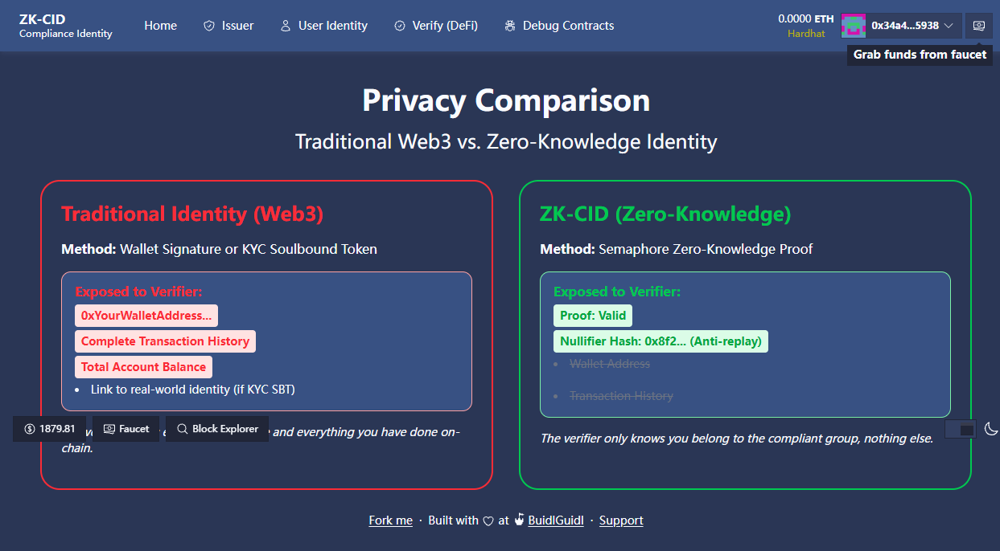
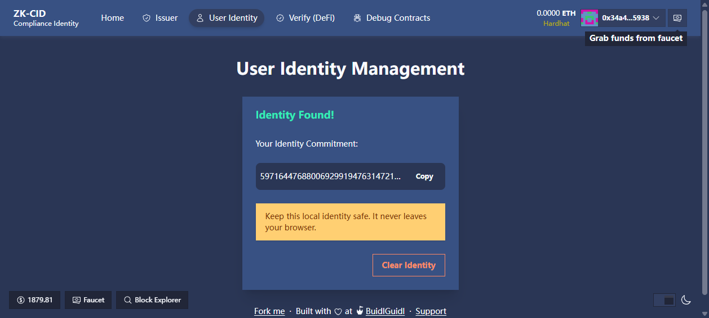
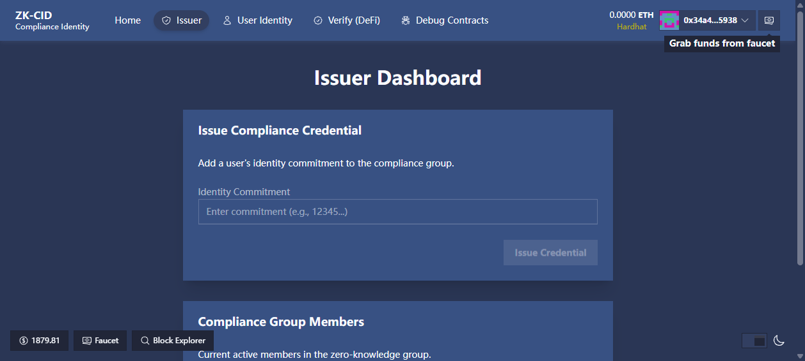

# ZK-CID 🛡️
**Zero-Knowledge Compliance Identity & Decentralized Workflow Orchestration**

> **一句话定位**: "ZK-CID 用 ZK 零知识证明保护 Web3 用户验证端隐私，用 Chainlink CRE 消除颁发端信任——合规数据由去中心化预言机网络自动编排，用户隐私由数学密码学守护。"



## 🏆 参赛赛道
- **主赛道**: Law / Finance / Compliance (Blockchain Legal Institute)
- **附加赏金**: Best Workflow with CRE (Chainlink)

---

## 🌐 Live Demo
- **URL**: [https://web-3-0-decentralized.vercel.app](https://web-3-0-decentralized.vercel.app) (Requires MetaMask connected to Sepolia Testnet or local fork)
- **Sepolia 部署与复现**: [SEPOLIA_DEPLOYMENT.md](./SEPOLIA_DEPLOYMENT.md)
## 💡 问题陈述与解决方案

当前的 Web3 合规面临着**“双重信任困境”**：
1. **验证端隐私泄露**：传统的 KYC 门控要求用户直接出示身份以通过验证，从而暴露了底层隐私数据，不符合 Web3 匿名精神和 GDPR 标准。
2. **颁发端单点信任与更新滞后**：合规状态（例如：是否处于 OFAC 制裁名单）通常由中心化机构人工维护。这不仅存在人为操纵的单点信任风险，且撤销机制往往不够及时。

**ZK-CID 的破局之道**：
- **ZK 隐私保护 (Semaphore v4)**：机构仅颁发一个身份承诺 (Commitment) 上链，用户在本地生成有效 ZK Proof（零知识证明），在**零身份暴露**的情况下向 DeFi 协议（Verifier）证明自己的合规属性，并完成 NFT Mint。
- **去中心化运维编排 (Chainlink CRE)**：彻底淘汰人工黑名单更新。利用 Chainlink CRE SDK 编写的 Serverless 工作流定期拉取外部合规 API（Mock OFAC），达成共识后**全自动撤销**链上违规用户的凭证。

---

## 🛠 技术栈
- **核心逻辑 & ZKP**: Semaphore v4 Protocol
- **合约层**: Solidity 0.8.23 + Hardhat
- **前端展示**: Next.js (App Router) + Scaffold-ETH 2 + wagmi
- **预言机编排层 (CRE Bounty)**: Chainlink CRE SDK (TypeScript) + Vercel (Mock API)
- **测试网/环境**: Anvil Localnet 

---

## 🚀 Quickstart(本地端到端演示)

```bash
# 0. 安装依赖(项目根目录)
yarn install

# 终端 1:启动本地链
yarn chain

# 终端 2:部署合约(自动为前端生成 TS ABI)
yarn deploy

# 终端 3:启动 Mock 制裁名单 API(默认 http://localhost:3001)
cd mock-api && npm install && npm start

# 终端 4:启动前端(默认 http://localhost:3000)
yarn start
```

打开 `http://localhost:3000/zk-cid` 进入主演示路径(首页为 ZK-CID 落地页;`/user`、`/issuer`、`/verify` 为 Legacy 页面,顶部有徽章标注)。

### CRE 工作流(附加赏金路径)

`workflows/compliance-lifecycle/` 为独立的 Chainlink CRE 工作流:Cron 定时拉取 Mock 制裁名单 API,与链上 `ComplianceGate.getMembers()` 求交集,对命中者自动调用 `revokeCredential` 完成链上撤销。代码按真实 `@chainlink/cre-sdk@1.16.0` API 编写,已通过 `tsc` 类型检查。

> ⚠️ **诚实声明**:本仓库开发机未安装 CRE CLI,`cre workflow simulate` 端到端模拟**尚未实测**。完整复现步骤与已知风险见 `workflows/compliance-lifecycle/evidence/README.md`,核心命令:

```bash
# 需先安装 CRE CLI(参考 https://docs.chain.link/cre)
cd workflows/compliance-lifecycle
cre workflow simulate .
```

---

## 🎯 核心功能与演示截屏

### 1. 传统 Web3 KYC vs ZK-CID 体验对比
我们在 `app/demo` 中构建了直观的上帝视角双栏对比页面，让非技术评委也能一秒看懂 ZKP 的价值。

### 2. 身份生成与无感授权
用户在本地浏览器生成唯一的 Semaphore 身份（Private Key 绝不离端）。在证明合规时，链上仅仅记录一个由数学生成的 `Nullifier Hash`。



### 3. 机构发证与状态监控
授权的合规机构（Issuer）确认用户身份后，将其 `Commitment` 追加至智能合约的 Merkle Tree 中。



### 4. 自动化违规撤销 (CRE Workflow)
一旦用户命中 Mock API 中的外部制裁名单，部署在去中心化网络上的 Chainlink CRE Workflow 将立即捕获，并**自动发起链上撤销（revokeCredential）**，阻断该用户后续的 ZK Proof 验证。

---

## 🔗 链上执行记录 (PoC Evidence)

由于本产品强调“一键式自动确权”，我们在本地主链路跑通了端到端（发证->生成证明->智能合约校验->自动 Mint）的全验证流程。

> Sepolia 线上部署地址与 smoke-test 交易见 [SEPOLIA_DEPLOYMENT.md](./SEPOLIA_DEPLOYMENT.md)；本节保留本地 Anvil/Hardhat 复现证据。

> 📌 以下地址/tx 为 2026-07-19 本地完整重部署后的最新链上证据；重启本地链后，最新地址请以 `packages/hardhat/deployments/localhost/*.json` 为准。

| 步骤 | 状态 | On-Chain Hash |
|------|------|---------------|
| **部署 MockSemaphore** | ✅ | `0x5FbDB2315678afecb367f032d93F642f64180aa3` |
| **部署 ComplianceGate** | ✅ | `0xe7f1725E7734CE288F8367e1Bb143E90bb3F0512` |
| **部署 AccessNFT** | ✅ | `0x9fE46736679d2D9a65F0992F2272dE9f3c7fa6e0` |
| **Issuer 颁发凭证** | ✅ | `0x93064d9effc3b57a26c946f5fb49609a3e0f491b0a4f1352ab43ba67524d9158` |
| **用户出示 ZKP 并 Mint NFT** | ✅ | `0x6b60a9014547c375c8d7bb20ec77686a38fd46882314824dbb36b435f1974adc` |
| **CRE 命中制裁名单并撤销凭证** | ✅ | `0x497fd6ba8d5bd5c0837435ef1b1e6d3150bf961b8ad0611db2ac11734ea7448c` |
| **撤销后再次 Mint（应失败）** | ✅ 已拦截 | revert `Credential revoked`（`hasBeenRevoked` 强制检查） |

> *注：用户 Mint 成功后，智能合约会拦截其生成的唯一 Nullifier，有效防止了双花/重放攻击。*

---

## 🚀 商业影响 (Business Impact)
ZK-CID 提供了一种**可插拔、无需信任的合规中间件**。对于 DeFi 协议（DEX, 借贷），它们只需接入我们的 `Gate` 接口即可无缝拥抱监管，并彻底免除自身触碰、存储用户隐私敏感数据的法律风险，实现商业利益与合规安全的完美平衡。

---

## ⚠️ Known Limitations / Demo Mode

为在黑客松期间可重复演示，当前版本存在以下已知限制（均已在代码中显式标注，不回避）：

- **Demo Mode 默认开启**：`ComplianceGate` 以 `demoMode = true` 部署，本地演示使用 MockSemaphore 校验路径；严格模式需由 issuer 调用 `setDemoMode(false)` 并配置真实的 Semaphore 部署（demoMode 关闭后，`validateProof` 失败必然 revert）。
- **撤销的 Merkle 语义**：`verifyCompliance` 强制检查 `hasBeenRevoked` 标记，被撤销凭证无法再通过验证；但从 ZK Merkle 树中移除节点目前传入空 siblings，生产环境需接入 Merkle 索引器（如 The Graph / 自建 indexer）提供真实 siblings 路径。
- **CRE simulate 未实测**：工作流代码已通过 `tsc` 类型检查，但 `cre workflow simulate` 需在安装 CRE CLI 的环境中执行；`writeReport` 在纯本地链上的支持取决于 CRE 模拟环境的链配置（详见 `workflows/compliance-lifecycle/evidence/README.md`）。
- **文档中的链上地址**：README / DEMO_SUMMARY 中的地址与交易哈希来自 2026-07-19 本地完整重部署（最新证据），链重启/重部署后以 `packages/hardhat/deployments/localhost/*.json` 为准。

---

## 📁 目录结构导览
```text
zk-cid/
├── packages/
│   ├── hardhat/                    # 智能合约层 (Semaphore/Gate/AccessNFT)
│   └── nextjs/                     # DApp 前端层 (Identity/Proof/对比展示页)
├── workflows/compliance-lifecycle/ # CRE 编排层 (Chainlink SDK 独立模块)
└── mock-api/                       # 链下数据层 (模拟的制裁名单微服务)
```

**Developed with ❤️ for BLI Legal Tech Hackathon Edition 2**
